# 图表生成验证记录（2026-09-21）

## 结论

- 本地交付压力测试：20 轮，全部通过；覆盖 1–4 张图、柱状/横向柱状/折线/饼/雷达/矩形树图。
- 57 环境真实 Run：20 轮，全部通过；每轮状态为 succeeded，返回 Mermaid 数量与请求数量一致。
- 每轮均检查：重复 Mermaid、未闭合代码围栏、xychart 语句挤行；均为 0。
- 修复点：交付校验比较前解码 Mermaid 数字实体（例如 `#37;` 与 `%`），避免饼图被误判为漏图而重复追加。

## 57 环境逐轮结果

|轮次|场景|请求图数|返回图数|重复|未闭合|挤行|Run|
|---:|---|---:|---:|---:|---:|---:|---|
|1|单柱状图|1|1|0|否|0|`chart-stress-20260921-01-0dfab963`|
|2|单横向柱状图|1|1|0|否|0|`chart-stress-20260921-02-5c721da8`|
|3|单折线图|1|1|0|否|0|`chart-stress-20260921-03-043a20e9`|
|4|单饼图|1|1|0|否|0|`chart-stress-20260921-04-950e56b8`|
|5|单雷达图|1|1|0|否|0|`chart-stress-20260921-05-e1dc47c2`|
|6|单矩形树图|1|1|0|否|0|`chart-stress-20260921-06-2f485941`|
|7|柱状加折线|2|2|0|否|0|`chart-stress-20260921-07-5a028cf1`|
|8|柱状饼图折线|3|3|0|否|0|`chart-stress-20260921-08-1abef6a4`|
|9|四图产业|4|4|0|否|0|`chart-stress-20260921-09-0c292c44`|
|10|雷达加树图|2|2|0|否|0|`chart-stress-20260921-10-f19e5fbe`|
|11|横向折线饼图|3|3|0|否|0|`chart-stress-20260921-11-70c6e0f6`|
|12|四类混合|4|4|0|否|0|`chart-stress-20260921-12-4a4a9b36`|
|13|单百分比柱状图|1|1|0|否|0|`chart-stress-20260921-13-2d1e03ee`|
|14|百分比柱状加饼图|2|2|0|否|0|`chart-stress-20260921-14-f7fb4d1d`|
|15|多年度趋势|3|3|0|否|0|`chart-stress-20260921-15-bc41f9a8`|
|16|四图经营指标|4|4|0|否|0|`chart-stress-20260921-16-f1675cc5`|
|17|雷达折线|2|2|0|否|0|`chart-stress-20260921-17-1fa83d53`|
|18|树图柱状折线|3|3|0|否|0|`chart-stress-20260921-18-0d5f2737`|
|19|重复产业组合|4|4|0|否|0|`chart-stress-20260921-19-4f3e9700`|
|20|百分比折线加雷达|2|2|0|否|0|`chart-stress-20260921-20-29bdbbc6`|

## 57 环境完整返回正文

以下保留每轮模型最终正文，便于检查实际 Markdown：

### 第 1 轮：单柱状图（chart-stress-20260921-01-0dfab963）

```text
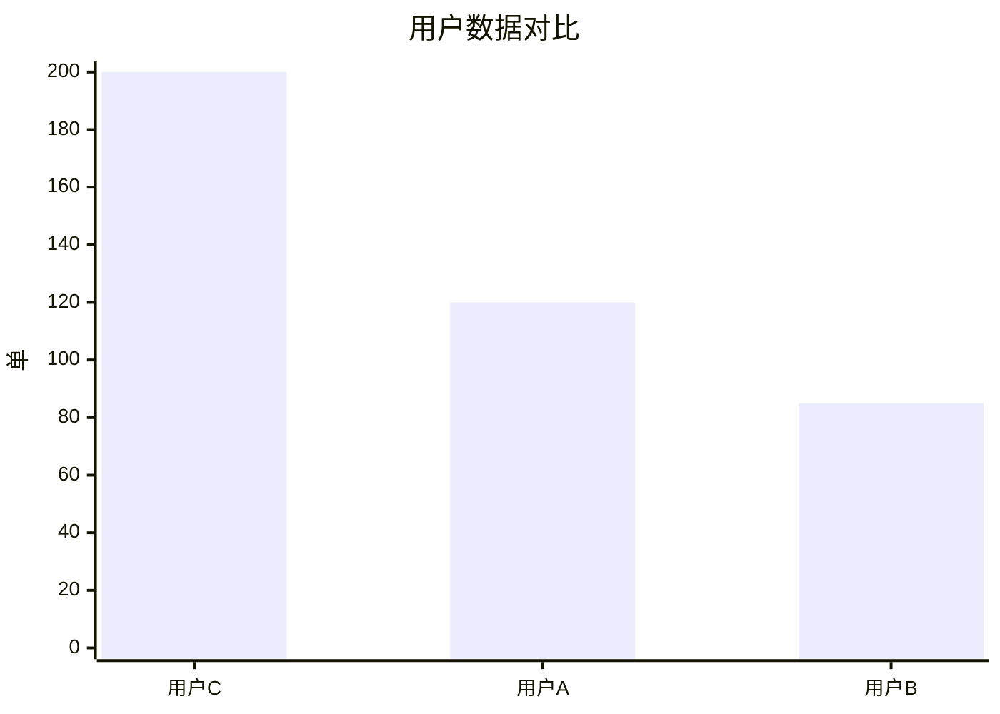
```

### 第 2 轮：单横向柱状图（chart-stress-20260921-02-5c721da8）

```text
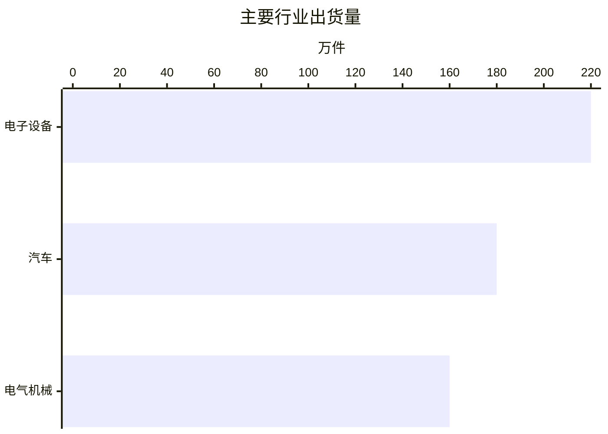
```

### 第 3 轮：单折线图（chart-stress-20260921-03-043a20e9）

```text
```mermaid
%%{init: {'theme': 'default'}}%%
line Chart
    title 各月数据趋势
    x-axis 月份
    "1月": -2.5
    "2月": 0.000001
    "3月": 3.2
    "4月": 5.5
```
```

### 第 4 轮：单饼图（chart-stress-20260921-04-950e56b8）

```text
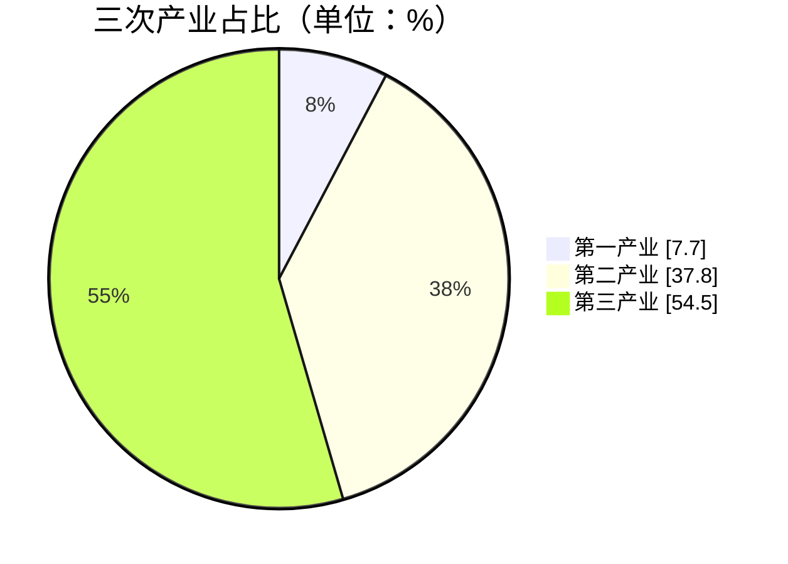
```

### 第 5 轮：单雷达图（chart-stress-20260921-05-e1dc47c2）

```text
```mermaid
radar
    title 综合能力评估
    labels ["质量", "效率", "协作"]
    values [80, 65, 90]
    unit "分"
```
```

### 第 6 轮：单矩形树图（chart-stress-20260921-06-2f485941）

```text
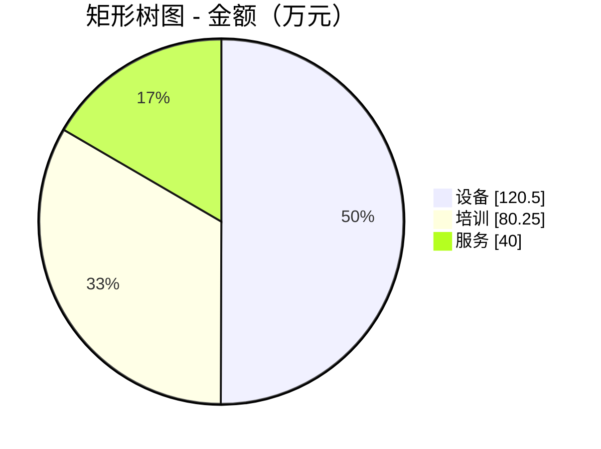
```

### 第 7 轮：柱状加折线（chart-stress-20260921-07-5a028cf1）

```text
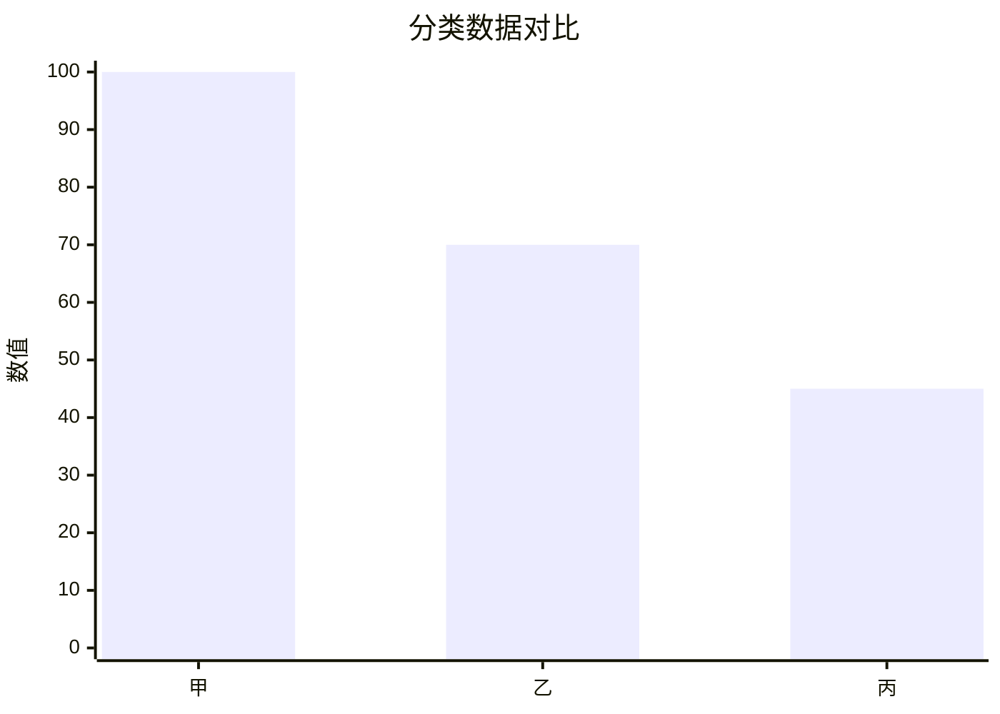

```mermaid
xychart-beta
    title "月度变化趋势"
    x-axis ["1月", "2月", "3月"]
    y-axis "数值" 0 --> 15
    line [10, 15, 12]
```
```

### 第 8 轮：柱状饼图折线（chart-stress-20260921-08-1abef6a4）

```text
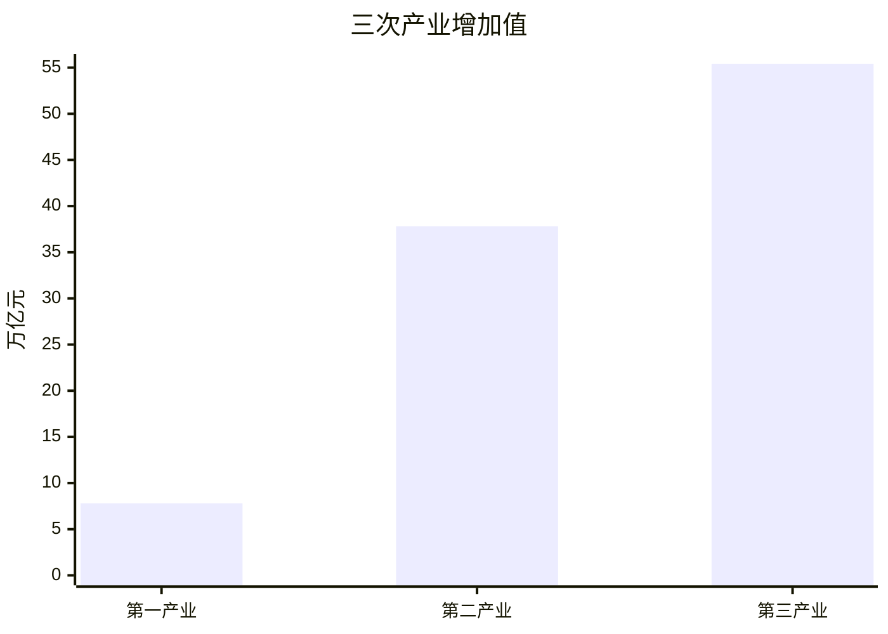


```mermaid
xychart-beta
    title "GDP趋势"
    x-axis ["2018年", "2019年", "2020年"]
    y-axis "万亿元" 0 --> 101.6
    line [91.9, 99.1, 101.6]
```
```

### 第 9 轮：四图产业（chart-stress-20260921-09-0c292c44）

```text
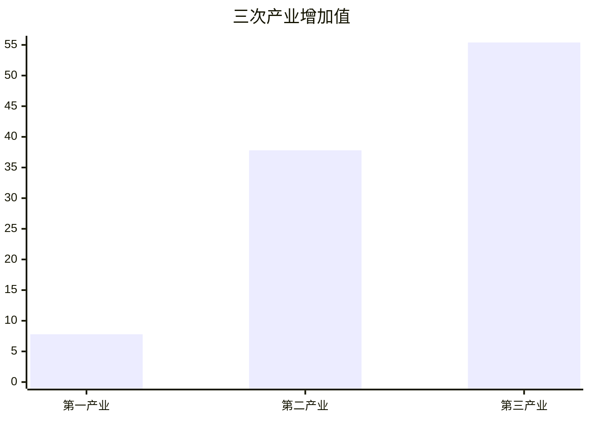


```mermaid
xychart-beta
    title "GDP趋势"
    x-axis ["2016年", "2017年", "2018年", "2019年", "2020年"]
    y-axis 0 --> 101.6
    line [74.6, 83.2, 91.9, 99.1, 101.6]
```

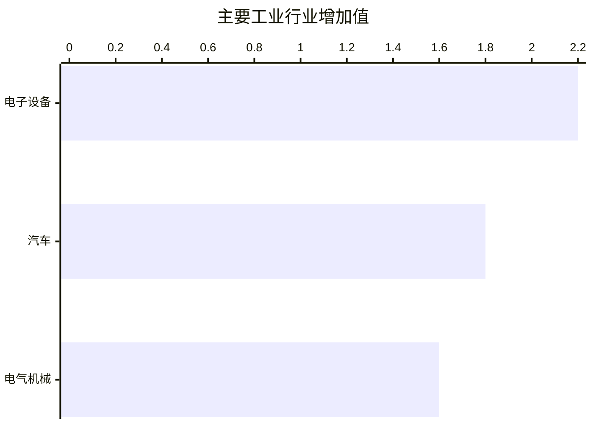
```

### 第 10 轮：雷达加树图（chart-stress-20260921-10-f19e5fbe）

```text
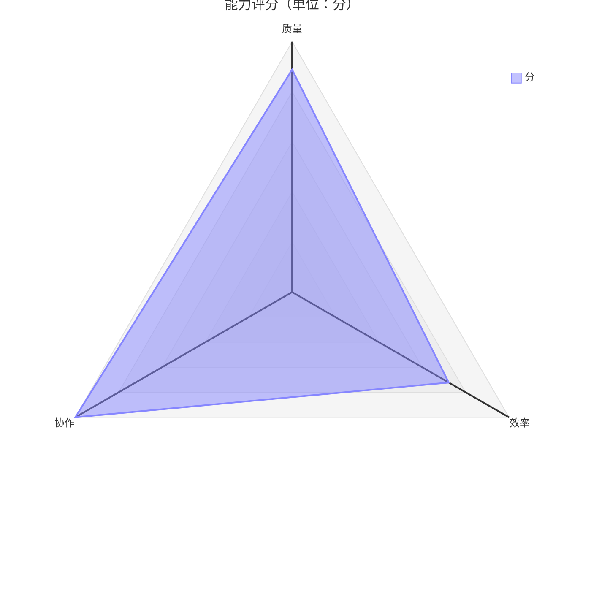

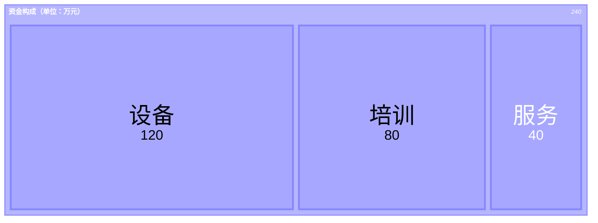
```

### 第 11 轮：横向折线饼图（chart-stress-20260921-11-70c6e0f6）

```text
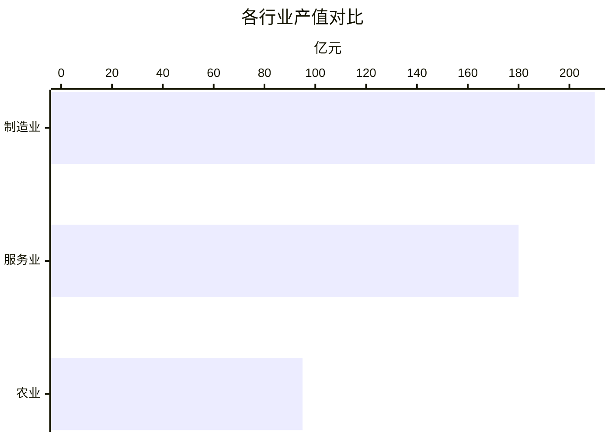

```mermaid
xychart-beta
    title "季度产值变化趋势"
    x-axis ["Q1", "Q2", "Q3", "Q4"]
    y-axis "亿元" 0 --> 22
    line [12, 18, 16, 22]
```

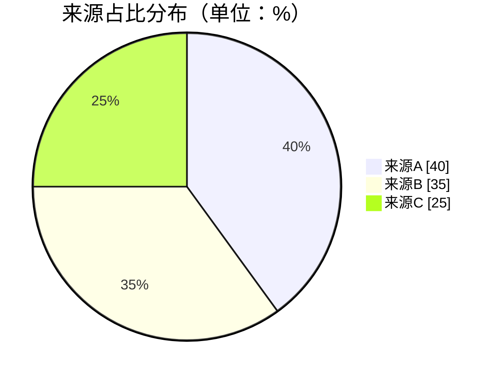
```

### 第 12 轮：四类混合（chart-stress-20260921-12-4a4a9b36）

```text
```mermaid
xychart-beta
    title "订单数量"
    x-axis ["甲", "乙", "丙"]
    y-axis 0 --> 200
    bar [200, 120, 85]
```

```mermaid
xychart-beta
    title "月度数据趋势"
    x-axis ["1月", "2月", "3月"]
    y-axis 0 --> 30
    line [20, 30, 25]
```

```mermaid
pie showData
    title 用户占比（单位：%）
    "A" : 50
    "B" : 30
    "C" : 20
```

```mermaid
radar-beta
    title 能力评估（单位：分）
    axis a0["质量"], a1["效率"], a2["协作"]
    curve data["分"]{70, 80, 90}
    min 0
    max 90
    graticule polygon
```
```

### 第 13 轮：单百分比柱状图（chart-stress-20260921-13-2d1e03ee）

```text
```mermaid
xychart-beta
    title "完成率对比"
    x-axis ["完成率A", "完成率B", "完成率C"]
    y-axis "%" 0 --> 95
    bar [95, 88, 76]
```
```

### 第 14 轮：百分比柱状加饼图（chart-stress-20260921-14-f7fb4d1d）

```text
```mermaid
xychart-beta
    title "部门完成率"
    x-axis ["甲", "乙", "丙"]
    y-axis "%" 0 --> 95
    bar [95, 88, 76]
```

```mermaid
pie showData
    title 部门占比（单位：%）
    "甲" : 40
    "乙" : 35
    "丙" : 25
```
```

### 第 15 轮：多年度趋势（chart-stress-20260921-15-bc41f9a8）

```text
```mermaid
xychart-beta
    title "年度GDP"
    x-axis ["2020", "2021", "2022"]
    y-axis "万亿元" 0 --> 121
    line [101.6, 114.4, 121]
```

```mermaid
xychart-beta
    title "产业增加值"
    x-axis ["第一产业", "第二产业", "第三产业"]
    y-axis "万亿元" 0 --> 60
    bar [8, 40, 60]
```

```mermaid
pie showData
    title 产业占比（单位：%）
    "第一产业" : 7.4
    "第二产业" : 37
    "第三产业" : 55.6
```
```

### 第 16 轮：四图经营指标（chart-stress-20260921-16-f1675cc5）

```text
```mermaid
xychart-beta
    title "订单数量"
    x-axis ["A", "B", "C"]
    y-axis 0 --> 180
    bar [180, 140, 90]
```

```mermaid
xychart-beta horizontal
    title "区域收入"
    x-axis ["华东", "华南", "华北"]
    y-axis "万元" 0 --> 220
    bar [220, 180, 150]
```

```mermaid
xychart-beta
    title "季度营收趋势"
    x-axis ["Q1", "Q2", "Q3", "Q4"]
    y-axis 0 --> 20
    line [12, 15, 13, 20]
```

```mermaid
pie showData
    title 成本构成（单位：%）
    "人力" : 45
    "物料" : 35
    "其他" : 20
```
```

### 第 17 轮：雷达折线（chart-stress-20260921-17-1fa83d53）

```text
```mermaid
radar-beta
    title 综合能力（单位：分）
    axis a0["质量"], a1["效率"], a2["协作"]
    curve data["分"]{85, 75, 90}
    min 0
    max 90
    graticule polygon
```

```mermaid
xychart-beta
    title "月度指标"
    x-axis ["1月", "2月", "3月"]
    y-axis "分" 0 --> 82
    line [70, 78, 82]
```
```

### 第 18 轮：树图柱状折线（chart-stress-20260921-18-0d5f2737）

```text
```mermaid
treemap-beta
"资金构成（单位：万元）"
    "设备": 100
    "培训": 60
    "服务": 40
```

```mermaid
xychart-beta
    title "项目数量"
    x-axis ["项目甲", "项目乙", "项目丙"]
    y-axis 0 --> 30
    bar [30, 20, 10]
```

```mermaid
xychart-beta
    title "季度进度"
    x-axis ["Q1", "Q2", "Q3", "Q4"]
    y-axis "%" 0 --> 65
    line [20, 35, 50, 65]
```
```

### 第 19 轮：重复产业组合（chart-stress-20260921-19-4f3e9700）

```text
```mermaid
xychart-beta
    title "产业增加值"
    x-axis ["第一产业", "第二产业", "第三产业"]
    y-axis 0 --> 55.4
    bar [7.8, 37.8, 55.4]
```

```mermaid
pie showData
    title 产业占比（单位：%）
    "第一产业" : 7.7
    "第二产业" : 37.8
    "第三产业" : 54.5
```

```mermaid
xychart-beta
    title "GDP走势"
    x-axis ["2016", "2017", "2018", "2019", "2020"]
    y-axis 0 --> 101.6
    line [74.6, 83.2, 91.9, 99.1, 101.6]
```

```mermaid
xychart-beta horizontal
    title "工业行业增加值"
    x-axis ["电子设备", "汽车", "电气机械"]
    y-axis 0 --> 2.2
    bar [2.2, 1.8, 1.6]
```
```

### 第 20 轮：百分比折线加雷达（chart-stress-20260921-20-29bdbbc6）

```text
```mermaid
xychart-beta
    title "季度完成率"
    x-axis ["Q1", "Q2", "Q3", "Q4"]
    y-axis "%" 0 --> 93
    line [62, 74, 81, 93]
```

```mermaid
radar-beta
    title 能力评估（单位：分）
    axis a0["质量"], a1["效率"], a2["协作"]
    curve data["分"]{88, 72, 95}
    min 0
    max 95
    graticule polygon
```
```

## 本地 20 轮场景摘要

|轮次|请求/交付|图表类型|
|---:|---:|---|
|1|2/2|bar-horizontal、line|
|2|3/3|line、pie、radar|
|3|4/4|pie、radar、treemap、bar|
|4|1/1|radar|
|5|2/2|treemap、bar|
|6|3/3|bar、bar-horizontal、line|
|7|4/4|bar-horizontal、line、pie、radar|
|8|1/1|line|
|9|2/2|pie、radar|
|10|3/3|radar、treemap、bar|
|11|4/4|treemap、bar、bar-horizontal、line|
|12|1/1|bar|
|13|2/2|bar-horizontal、line|
|14|3/3|line、pie、radar|
|15|4/4|pie、radar、treemap、bar|
|16|1/1|radar|
|17|2/2|treemap、bar|
|18|3/3|bar、bar-horizontal、line|
|19|4/4|bar-horizontal、line、pie、radar|
|20|1/1|line|

## 说明

- 远端日志以 UTF-8 保存；表格中的中文场景名来自远端 Run。
- 本文只记录验证输出，不替代代码中的测试。
